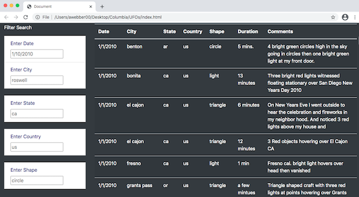

# UFOs

## Project Overview
The purpose of this analysis is to provide a more in-depth analysis of UFO sightings by allowing users to filter for multiple criteria at the same time. In addition to the date, a table was added with filters for the city, state, country, and shape.

## Resources 
- **Data Source:** [data.js](data.js) 
- **Starter Code:** [app.js](app.js)
- **Stylesheet Code:** [style.css](style.css)
- **Software:** VS Code

## Languages 
- **Javascript**
- **HTML**
- **CSS**

## Objectives  
- Initialize a repository with a README, and write an analysis for Deliverable 1.
- Build and deploy JavaScript functions, including built-in functions. 
- Convert JavaScript functions to arrow functions. 
- Build and deploy forEach (JavaScript for loop). 
- Create, populate, and dynamically filter a table using JavaScript and HTML. 
- Launch a functioning webpage via index.html

## HTML Page & Results

- Creation and deployment of JavaScript functions to provide additional table filters.
- Update and deployment of forEach (for loop) to loop through the filters and update them with user input.
- Update and population of the dynamic filters and table using JavaScript and HTML.  

## How To Perform A Search
 A user can perform a search by typing their criteria into the search fields on the left side of their screen.
 

## Limitations & Recommendations

One drawback or limitation of this webpage is that it is not very user friendly. Two recommendations can be made to improve the webpage:

- Filtering of the other available coulmns would provide the user with better interaction possibilities.

- Drop down menus for input would make the search function more dynamic.

